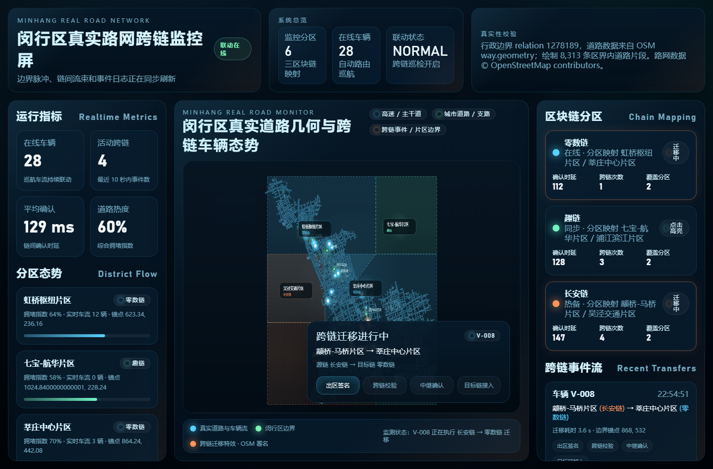
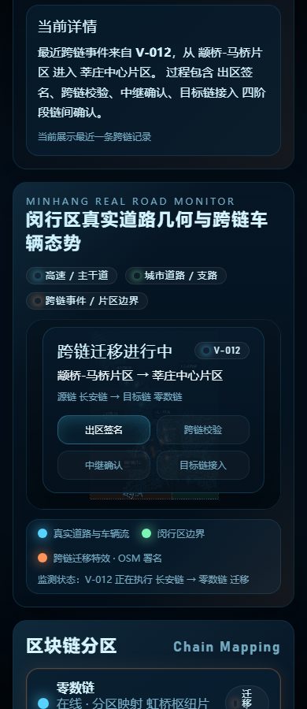

# 闵行区真实路网跨链交通监控屏

这是一个单文件 Canvas 交通态势演示页面，核心页面在 `index.html`。页面使用 OpenStreetMap/Overpass 下载的上海市闵行区真实道路几何数据，展示闵行区路网、链映射片区、车辆巡航、跨链迁移事件和运行指标。

## 展示图

桌面大屏效果：



移动端地图区域效果：



## 功能概览

- 真实闵行区道路底图：道路几何来自 OSM `way.geometry`，嵌入到 `index.html`，不依赖在线地图 SDK 或 API Key。
- 多级道路渲染：高速、快速路、主干路、次干路、支路用不同亮度和线宽展示。
- 车辆巡航动画：车辆沿真实道路端点图生成的多段路线行驶，避免单条短线段往返抖动。
- 跨链事件演示：车辆跨越链映射片区时触发迁移浮层、事件流和链间确认阶段。
- 数据校验信息：页面内展示 OSM relation、绘制道路片段数量和 OSM 署名。
- 响应式布局：支持桌面大屏和窄屏移动视口。

## 数据来源

数据来自 OpenStreetMap Overpass API：

- 行政区：闵行区
- OSM relation：`1278189`
- Overpass 时间戳：`2026-05-13T14:38:00Z`
- 原始道路 way 数：`14,574`
- 区界内绘制道路片段：`8,313`
- 命名道路：`7,203`
- 署名：Data © OpenStreetMap contributors, ODbL 1.0

关键道路抽查已命中：

- 外环高速
- 嘉闵高架路
- 沪闵路 / 沪闵高架路
- 七莘路
- 虹梅路 / 虹梅高架路
- 莲花路 / 莲花南路
- 顾戴路
- 吴中路
- 申长路

## 本地运行

直接打开 `index.html` 可以查看页面。如果浏览器或测试工具限制 `file://`，可以启动本地 HTTP 服务：

```powershell
python -m http.server 8765 --bind 127.0.0.1
```

然后访问：

```text
http://127.0.0.1:8765/index.html
```

## 文件说明

- `index.html`：完整演示页面，包含样式、OSM 离线道路数据、Canvas 渲染和车辆动画逻辑。
- `qa-routes-desktop.png`：桌面端 GUI 验证截图。
- `qa-mobile-map.png`：移动端地图区域 GUI 验证截图。
- `qa-desktop.png`、`qa-mobile.png`：早期验证截图，可作为对比参考。

## 验证记录

已完成的检查：

- JavaScript 语法检查通过。
- 浏览器加载无 console error/warning。
- Canvas 非空像素检测通过。
- 桌面视口截图观察通过。
- 移动视口地图区域截图观察通过。
- 车辆路线生成结果：
  - 路线数：`27`
  - 最短路线：约 `1,754 px`
  - 最长路线：约 `7,653 px`
  - 平均路线：约 `4,425 px`
  - 单路线最少路径点：`66`

## 设计说明

页面不是 GIS 查询系统，而是交通跨链监控大屏演示。为了保证展示效果和真实性之间的平衡：

- 道路几何保持 OSM 原始折线投影，不手绘替代。
- 底图静态预渲染到 Canvas，动画层只绘制车辆、跨链特效和标签，保证性能稳定。
- 车辆路线基于真实道路端点图生成，由多个相邻路段组成，再整体返程闭合。
- 链映射片区是演示层数据，用于触发跨链事件，不代表官方行政或交通分区。
